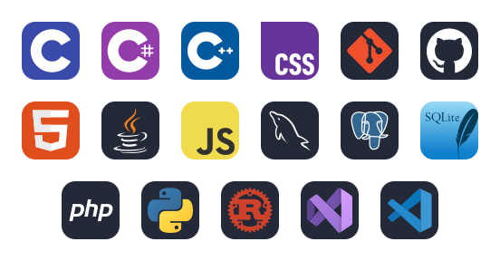

# Skill Icons GitHub Actions

A clean-room rebuild that runs entirely in GitHub Actions.

## What it does

- scans `icons/`
- builds `dist/manifest.json`
- renders one combined SVG to `dist/skill-icons.svg`
- runs every 12 hours on GitHub Actions
- uses `config.json` by default
- lets `workflow_dispatch` override config with inputs
- rewrites SVG IDs, references, and nested style selectors before composition

## Demo



## GitHub Actions usage

The workflow runs on this schedule:

```yaml
schedule:
  - cron: '0 */12 * * *'
```

Manual runs can override the defaults with inputs in the Actions UI.

## Local usage

```bash
npm install
npm run build
npm run render
```

You can also pass icons directly on the command line:

```bash
node render.js --icons c,cs,cpp,css,git,github,html,java,js,mysql,postgres,sqlite,php,python,rust,visualstudio,vscode
```

Or use environment variables:

```powershell
$env:ICON="c,cs,cpp,css,git,github,html,java,js,mysql,postgres,sqlite,php,python,rust,visualstudio,vscode"
npm run render
```

## config.json

`config.json` is the default source of truth when no env or CLI overrides are provided.

## Workflow inputs

- `icons`
- `align`
- `theme`
- `perLine`
- `gapX`
- `gapY`
- `marginX`
- `marginY`
- `iconSize`

## Notes

- `aliases.json` supports aliases that map to one or more candidate families.
- Unknown icons stop the render with a clear error and suggestions.
- The root SVG includes `xmlns:xlink` for compatibility.
- SVG fragments are rewritten before composition so gradients, masks, filters, clip paths, and CSS selectors do not collide.
